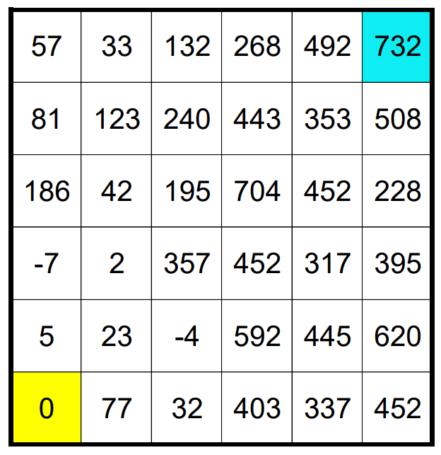
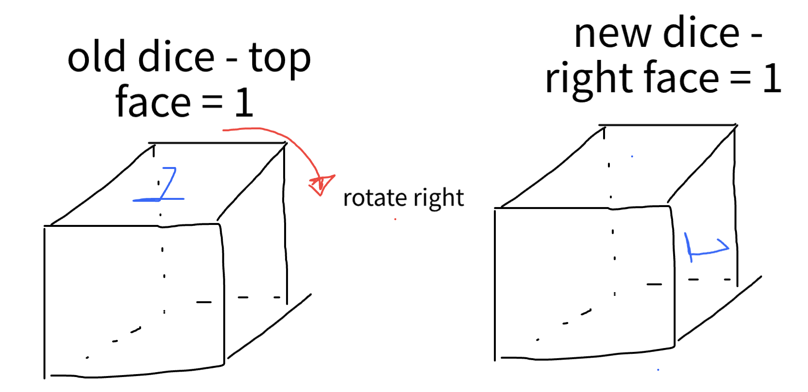

## Overview

See the Jane Street Puzzle site for [Die Agony](https://www.janestreet.com/puzzles/die-agony-index/), the December 2022 monthly puzzle.

This puzzle asked solvers to place a dice with empty faces on the bottom left corner of a 6x6 grid, as shown below.



Each cell on the board has a given value. On any move, we do the following:
- Tip the dice into any orthogonally adjacent cell (left, right, up, down). This tip is just one tip, for example the dice will not roll multiple times when moving from square to square
- We can move from cell to cell if the score AFTER tipping is the same as the value in the new cell.
- The score increases by N * the value of the die's upward face. 

## Code Reference
- `die_agony.py`: solver
- `dice.py`: supplementary code (not used, see Failed Paths section)

## Clarifying Ambiguities

Some questions that I naturally had from the problem description.

1 - Can dice face values be fractional? I assumed no just for simplicity, and this assumption worked out. Traditionally even more complex die have integer faces.

2 - Can dice roll multiple times from cell to cell? I resolved no since the puzzle was fairly clear about tipping, which is one movement.

3 - Can cells be revisited multiple times? This was an interesting one since usually in backtracking problems you need to ensure you don't revisit past states, otherwise you fall into an infinite recursion loop. But in this case, I kind of assumed that the constraint of moving to a square only if a score matched would check against this infinite recursion, so yes cells can be visited multiple times.

## Solving the Puzzle
This puzzle was interesting to tackle, but the conceptual idea to use backtracking came as a natural one, since enumerate every possible dice rotation seemed to be a very tedious task. 

The reason for this was that the face values of the dice were unknown. We had the choice of assinging any value to a dice face, so why not assign whatever value that works for the next cell.

The way that a backtracking solution would work is that it would try to keep moving in one direction (say up) until it can't anymore. Once it reaches a failed path, it tries another direction. If all paths fail, then this cell is invalid for the given face values of the dice, so another path / dice value assignment is needed.

At a very high level, there were two options available at each cell going to another adjacent cell.

1 - If the new top face value (after going from the old cell to the new cell) is empty, assign that face value to whatever satisfies the below equation (per the puzzle rules).

```
new_score = board value at new cell
N = nth move in sequence
f = face value on dice's top face

new_score = old_score + N * f

We want to solve for f 
(new - old_score) / N = f
```

2 - If the new top face value has already been assigned (in a previous iteration), check if this value satisifies moving to the adjacent cell.

## Failed Paths

Finding ways to represent the dice was definitely the trickiest part of this puzzle. When starting to code, I realized that the dice is constantly rotating, so we need to keep track of what face is on top, and what are the adjacent faces, since those values might be the next top face. 

I started by storing hashmaps of how the dice could possibly rotate. For example, if I rotate to the right, then the face that was previously top becomes the right-side face. Here, physically having a cube and playing around with it made it easier to grasp conceptually. 



This is code is referenced in dice.py (which is not used in my solution) but was a potential way of keeping minimal representations of which of the 24 possible dice states we were currently in and which was next. 

In doing so, we track a combination of top and front states, and map what are all the next possible states, ie '12' (arbitrary numbers) -> '26' when rotating up (where 2 is the new top and 6 is the new front).

While this possibly could have worked, it was very hard to keep track of things, prompting me to find alternative ways of representing dice states. 

## Representing Dice
The final solution that I ended up on was much simpler than originally planned. We can just represent the dice as a 6-tuple for each side, and have a helper function that performs rotations in each of the four directions. That way we know the top value of the dice at any given time, and if the value is None / 0 - we can assign a new face value that satisfies the solution

## Concluding Notes
Overall a very fun puzzle and I would highly recommend giving it a go if you want to get better versed in backtracking. I added some other stuff to mess around with the puzzle including `reverse_engineer.py` which allows you to build a valid board (naive) from a starting dice state. From this I stored a bunch of board states and solve times in a sqlite database.